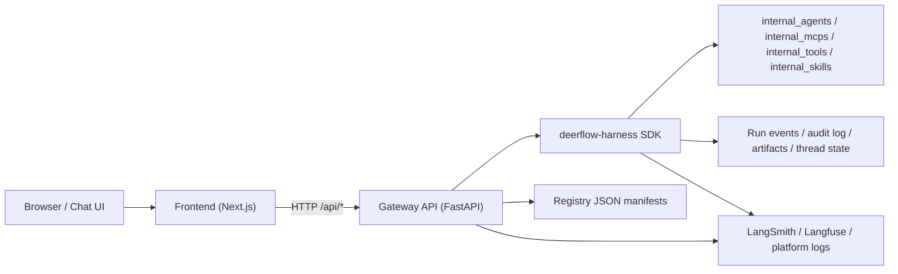
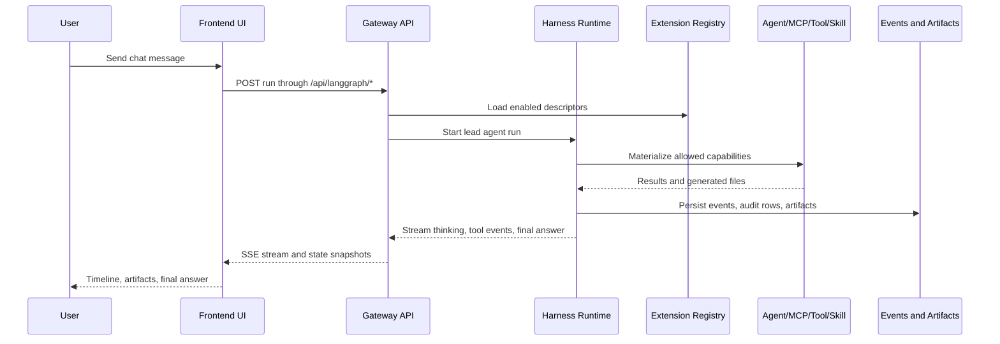
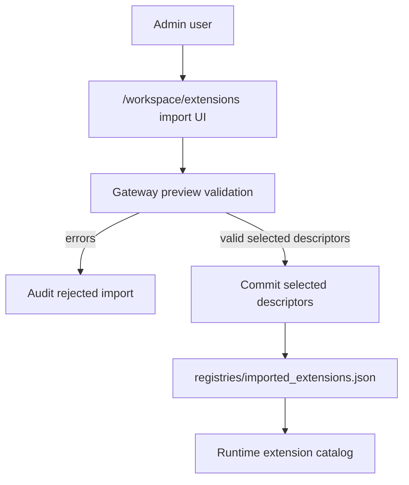

# Architecture and Flow

The hackathon app turns DeerFlow into a company-internal assistant platform. The
important separation is:

- UI is replaceable and talks to the Gateway over HTTP.
- Gateway owns browser-facing auth, registry APIs, audit APIs, health checks,
  and LangGraph-compatible run endpoints.
- Harness remains SDK-shaped under `backend/packages/harness`.
- Internal agents, MCPs, tools, and skills live outside the harness.
- Registries are configuration data and are validated before runtime use.

## Component Diagram

## Request Flow

## Registry Import Flow

## Runtime Boundaries

| Boundary | Owner | Contract |
| --- | --- | --- |
| UI to Gateway | HTTP APIs | UI may be split into a separate codebase or deployment. |
| Gateway to harness | Python package import | Harness can be packaged as `deerflow-harness`. |
| Harness to internal capabilities | Registry descriptors and importable entrypoints | Internal code remains outside the SDK package. |
| Registry import | JSON manifest schema | Untrusted until validation passes. |
| Artifacts | Harness artifact helpers | HTML, PDF, CSV, and generated files are served through Gateway controls. |

## Health and Readiness

- UI liveness: `GET /api/health`
- Gateway liveness: `GET /health`
- Operator readiness: authenticated `GET /api/readiness`
- Release readiness: `python scripts\production_readiness.py`
- Full fast gate: `python scripts\release_smoke.py --skip-e2e`

## Why This Is Demo-Friendly

- The extension registry proves dynamic loading for agents, MCPs, tools, and
  skills.
- The capability menu gives judges a visible entry point into those dynamic
  capabilities.
- Run timeline and audit evidence prove the harness streams thinking/tool steps,
  not just final answers.
- Generated HTML, CSV, and PDF artifacts prove the assistant can perform real
  internal work.
