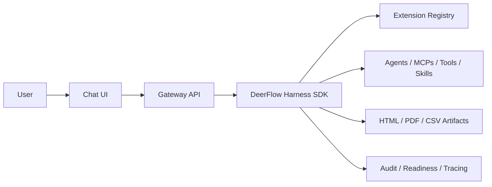

# Hackathon Use Case Template

Use this template to prepare the final hackathon submission. Replace bracketed
text with the details for the use case you are submitting. Keep the final copy
short, specific, and evidence-backed.

## 1. Use Case Summary

**Use case name:** [Internal Mini ChatGPT for Enterprise Workflows]

**One-line pitch:** [A governed company assistant that dynamically loads agents,
MCPs, tools, and skills to answer questions, execute approved workflows, and
generate auditable artifacts.]

**Primary audience:** [Example: delivery leaders, account teams, operations,
finance analysts, engineering managers]

**Business function:** [Example: delivery governance, sales enablement,
knowledge operations, internal reporting]

**Submission owner:** [Name / team]

**Demo environment:** [Local, Azure staging, Docker split demo, or hosted URL]

## 2. Problem Statement

Describe the current pain in business terms.

Prompts:

- What manual process is slow, risky, or inconsistent today?
- Who loses time or money because of it?
- What decisions are delayed because information or tools are scattered?
- Why is a normal chatbot insufficient?

Example:

> Internal teams need a single assistant that can find context, use approved
> company capabilities, generate reports, and produce audit evidence. Today,
> these steps are split across people, scripts, documents, and dashboards.

## 3. Target Users and Personas

| Persona | Current Pain | Desired Outcome |
| --- | --- | --- |
| [Persona 1] | [Pain] | [Outcome] |
| [Persona 2] | [Pain] | [Outcome] |
| [Persona 3] | [Pain] | [Outcome] |

## 4. Proposed Solution

Explain what the app does.

Required points:

- The user interacts through a chat UI.
- The Gateway/harness orchestrates agents and tools.
- Agents, MCPs, tools, and skills can be loaded dynamically from codebase
  directories or registry manifests.
- The harness streams thinking steps, tool activity, artifacts, and final
  answers back to the UI.
- The platform can generate HTML, PDF, CSV, and other files through approved
  tools.
- The UI and harness/Gateway can be deployed separately.

Concise solution statement:

> [Solution statement here.]

## 5. Dynamic Capabilities Used

List what the demo uses and what could be added later.

| Capability Type | Demo Example | Source | Business Purpose |
| --- | --- | --- | --- |
| Agent | `reporting-agent` | `internal_agents/` | Coordinates reporting workflows |
| MCP | `local-docs` | `internal_mcps/` or registry | Searches internal knowledge |
| Tool | `html-report`, `csv-export`, `pdf-report` | `internal_tools/` | Generates deliverables |
| Skill | `market-research` | `internal_skills/` | Adds reusable workflow instructions |

External registry import path:

1. Admin opens `/workspace/extensions`.
2. Admin previews a registry JSON manifest.
3. Gateway validates schema, entrypoints, source, risk, and duplicates.
4. Admin imports selected descriptors.
5. Enabled capabilities appear in the catalog and chat capability menu.

## 6. Demo Flow

Use this section as the live demo script.

1. Open the app: [URL].
2. Show `/workspace/extensions` and the loaded registry.
3. Show enabled agents, MCPs, tools, and skills.
4. Open chat and select [Capability / Hackathon demo flow].
5. Ask: `[Demo prompt]`.
6. Show streaming thinking/tool steps in the run timeline.
7. Show generated artifacts: [HTML/PDF/CSV].
8. Show audit/readiness evidence.
9. Close with the business value and next production step.

Demo prompt:

```text
[Paste final demo prompt here.]
```

Expected output:

- [Expected answer]
- [Expected artifact]
- [Expected audit or timeline evidence]

## 7. Architecture

Summarize the architecture in plain language.



Important architecture points:

- UI is replaceable and can live in a separate codebase.
- Gateway is the browser-facing trust boundary.
- Harness remains SDK-shaped under `backend/packages/harness`.
- Internal capabilities live outside the harness.
- Registry JSON drives dynamic loading.
- Readiness and audit endpoints give operators confidence before release.

## 8. Data, Security, and Governance

Describe how the solution is controlled.

| Control | How This App Handles It |
| --- | --- |
| Authentication | [Auth enabled in production; demo may disable auth locally] |
| Registry safety | Schema validation, import guardrails, source policy |
| Risk policy | Low/medium enabled by default; high-risk requires approval |
| Python execution | Allowlisted functions only |
| Audit evidence | Exportable sanitized audit evidence bundle |
| Retention | Configurable run event and artifact retention |
| Dependency audit | Release gate fails on new high/critical advisories |
| Rollback | Release operations runbook and checklist |

## 9. Observability

List what judges/operators can inspect.

- UI health: `GET /api/health`
- Gateway health: `GET /health`
- Admin readiness: `GET /api/readiness`
- Audit evidence export: `GET /api/audit/evidence`
- Run timeline in the UI
- LangSmith and/or Langfuse tracing, when configured
- Azure logs/Application Insights, when deployed to Azure

## 10. Business Value

Quantify the impact where possible.

| Value Driver | Expected Impact | Evidence |
| --- | --- | --- |
| Time saved | [Example: reduces report creation from hours to minutes] | [Demo artifact / user quote] |
| Quality | [Example: standardizes output structure] | [Template / generated report] |
| Governance | [Example: approved tools and audit evidence] | [Readiness / audit export] |
| Extensibility | [Example: new capabilities via JSON registry] | [Registry import demo] |

## 11. Success Metrics

Choose 3-5 measurable outcomes.

- [Metric 1: e.g., time to generate report]
- [Metric 2: e.g., number of approved capabilities loaded dynamically]
- [Metric 3: e.g., successful artifact generation rate]
- [Metric 4: e.g., readiness checks passing before release]
- [Metric 5: e.g., pilot user satisfaction]

## 12. Differentiators

Explain why this is better than a normal chatbot.

- Dynamic loading of agents, MCPs, tools, and skills.
- Separated UI, Gateway, and harness layers.
- Harness can be packaged as a Python SDK.
- Internal capabilities remain outside the harness.
- Tool/thinking steps stream to the UI.
- HTML, PDF, CSV, and Python function execution are available through approved
  tools.
- Enterprise readiness, dependency audit, rollback, and observability are part
  of the release path.

## 13. Screenshots and Evidence

Attach or link evidence for the submission.

| Evidence | Link / File |
| --- | --- |
| Extension registry | [Screenshot or `docs/pr-evidence/...`] |
| Chat capability picker | [Screenshot] |
| Run timeline | [Screenshot] |
| Generated HTML/PDF/CSV artifacts | [File paths] |
| Readiness report | [Command output or screenshot] |
| CI checks | [GitHub Actions URL] |
| Architecture diagram | `docs/architecture-flow.md` |

## 14. Implementation References

Use these paths when reviewers ask where the implementation lives.

- Registry examples: `registries/demo_extensions.json`,
  `registries/internal_extensions.example.json`
- Internal agents: `internal_agents/`
- Internal MCPs: `internal_mcps/`
- Internal tools: `internal_tools/`
- Internal skills: `internal_skills/`
- Harness SDK: `backend/packages/harness`
- Gateway registry APIs: `backend/app/gateway/routers/extensions.py`
- Readiness checks: `scripts/production_readiness.py`
- Release smoke gate: `scripts/release_smoke.py`
- Setup guide: `docs/local-and-azure-setup.md`
- Capability guide: `docs/capability-development.md`
- Observability guide: `docs/observability.md`
- Presentation outline: `docs/presentation-deck-outline.md`

## 15. Risks and Mitigations

| Risk | Mitigation |
| --- | --- |
| Sensitive data exposure | Auth, exact CORS origins, audit sanitization, no secrets in repo |
| Unsafe capability import | Registry validation, entrypoint allowlist, risk policy |
| Unapproved Python execution | Function allowlist and high-risk approval policy |
| Demo environment instability | Local smoke checks, release smoke, fallback screenshots |
| Dependency vulnerabilities | Dependency audit gate and expiring baseline |

## 16. Future Roadmap

Prioritize practical next steps.

1. Deploy to Azure staging with Key Vault-backed secrets.
2. Enable company SSO through Microsoft Entra ID or another OIDC provider.
3. Connect real internal MCP servers.
4. Add business-domain skills for the pilot team.
5. Add team-specific registry manifests and approval workflow.
6. Run a two-week pilot and measure time saved.

## 17. Final Submission Summary

Use this as the final short paragraph.

> [Project name] turns DeerFlow into a governed internal assistant platform. It
> lets teams dynamically load approved agents, MCPs, tools, and skills from code
> or registries; interact through a clean chat UI; stream reasoning/tool steps;
> generate auditable HTML, PDF, and CSV artifacts; and deploy with enterprise
> readiness checks, observability, and rollback controls.

