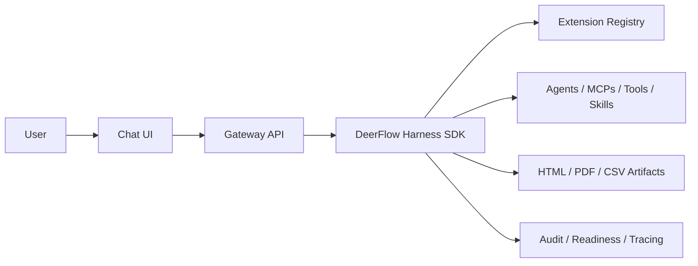

# Hackathon Use Case Template

Use this template for the final hackathon submission. The first nine sections
match the required submission fields exactly so the content can be copied into
the portal with minimal editing.

## Title:

[Internal Mini ChatGPT for Enterprise Workflows]

One-line version:

[A governed company assistant that dynamically loads agents, MCPs, tools, and
skills to answer questions, execute approved workflows, and generate auditable
artifacts.]

## Problem Statement:

Describe the current business pain in plain language.

Prompts:

- What manual process is slow, risky, or inconsistent today?
- Who loses time or money because of it?
- What decisions are delayed because information or tools are scattered?
- Why is a normal chatbot insufficient?

Example:

> Internal teams need a single assistant that can find context, use approved
> company capabilities, generate reports, and produce audit evidence. Today,
> these steps are split across people, scripts, documents, and dashboards.

## Proposed solution:

Explain what the app does and why it solves the problem.

Required points:

- Users interact through a familiar chat UI.
- The Gateway and DeerFlow harness orchestrate agents, MCPs, tools, and skills.
- Capabilities load dynamically from internal code directories or registry JSON.
- Thinking steps, tool activity, generated artifacts, and final answers stream
  back to the UI.
- Approved tools can generate HTML, PDF, CSV, and other files.
- The UI can be deployed separately from the Gateway and harness SDK.

Concise solution statement:

> [Solution statement here.]

## Approach:

Describe how the solution was implemented.

Suggested structure:

1. Built on top of ByteDance DeerFlow 2.0.
2. Kept the harness SDK-shaped under `backend/packages/harness`.
3. Kept internal agents, MCPs, tools, and skills outside the harness.
4. Added registry manifests under `registries/` for dynamic loading.
5. Added Gateway APIs for extension catalog, import preview, import commit,
   health, readiness, audit, and artifacts.
6. Added UI surfaces for capability discovery, chat execution, run timeline,
   audit evidence, and generated artifacts.
7. Added release gates for readiness, dependency audit, CI, rollback, and
   production operations.

Implementation references:

- Registry examples: `registries/demo_extensions.json`,
  `registries/internal_extensions.example.json`
- Internal agents: `internal_agents/`
- Internal MCPs: `internal_mcps/`
- Internal tools: `internal_tools/`
- Internal skills: `internal_skills/`
- Harness SDK: `backend/packages/harness`
- Gateway registry APIs: `backend/app/gateway/routers/extensions.py`
- Readiness checks: `scripts/production_readiness.py`
- Release smoke gate: `scripts/release_smoke.py`

## High level workflow:

Use this as the live demo script.

1. Open the app: [URL].
2. Show `/workspace/extensions` and the loaded registry.
3. Show enabled agents, MCPs, tools, and skills.
4. Open chat and select [Capability / Hackathon demo flow].
5. Ask: `[Demo prompt]`.
6. Show streaming thinking/tool steps in the run timeline.
7. Show generated artifacts: [HTML/PDF/CSV].
8. Show audit/readiness evidence.
9. Close with the business value and next production step.

Workflow diagram:



Demo prompt:

```text
[Paste final demo prompt here.]
```

Expected output:

- [Expected answer]
- [Expected artifact]
- [Expected audit or timeline evidence]

## Innovation and Business Value:

Explain why this is different and why it matters.

Innovation points:

- Dynamic loading of agents, MCPs, tools, and skills from code or registry JSON.
- Separated UI, Gateway, and harness layers.
- Harness can be packaged as a Python SDK.
- Internal company capabilities remain outside the harness.
- Tool/thinking steps stream to the UI, not only final answers.
- HTML, PDF, CSV, and Python function execution are available through approved
  tools.
- Enterprise readiness, dependency audit, rollback, and observability are part
  of the release path.

Business value:

| Value Driver | Expected Impact | Evidence |
| --- | --- | --- |
| Time saved | [Example: reduces report creation from hours to minutes] | [Demo artifact / user quote] |
| Quality | [Example: standardizes output structure] | [Template / generated report] |
| Governance | [Example: approved tools and audit evidence] | [Readiness / audit export] |
| Extensibility | [Example: new capabilities via JSON registry] | [Registry import demo] |

## Expected Benefit:

Quantify the outcome where possible.

Suggested benefits:

- Faster report generation and internal research.
- Fewer handoffs between chat, scripts, documents, and dashboards.
- Reusable capability registry for future business workflows.
- Better governance through risk policy, approval controls, and audit evidence.
- Lower platform coupling because UI, Gateway, harness, and internal
  capabilities can evolve independently.

Success metrics:

- [Metric 1: time to generate a report]
- [Metric 2: number of approved capabilities loaded dynamically]
- [Metric 3: successful artifact generation rate]
- [Metric 4: readiness checks passing before release]
- [Metric 5: pilot user satisfaction]

## MVP Scope:

Define what is in scope for the hackathon MVP.

In scope:

- Chat UI for interacting with the assistant.
- Dynamic registry loading for agents, MCPs, tools, and skills.
- Internal example directories for agents, MCPs, tools, and skills.
- Capability menu and extension registry UI.
- HTML, PDF, and CSV artifact generation.
- Allowlisted Python function execution.
- Streaming run timeline and final answer.
- Admin readiness and audit evidence export.
- Local setup, Docker split demo, and Azure deployment guidance.

Out of scope for MVP:

- Full production SSO rollout for every identity provider.
- Real company data connectors beyond demo/internal examples.
- Multi-region production deployment.
- Fully automated approval workflow for high-risk external registries.
- Long-term user pilot analytics.

## Top five feature;

1. Dynamic extension registry for agents, MCPs, tools, and skills.
2. Separated UI, Gateway, and harness SDK architecture.
3. Chat capability picker with seamless user interaction.
4. Artifact generation for HTML, PDF, CSV, and allowlisted Python functions.
5. Enterprise controls: readiness, audit evidence, risk policy, dependency
   audit, observability, and rollback runbook.

## Personas:

| Persona | Current Pain | Desired Outcome |
| --- | --- | --- |
| [Persona 1] | [Pain] | [Outcome] |
| [Persona 2] | [Pain] | [Outcome] |
| [Persona 3] | [Pain] | [Outcome] |

## Dynamic Capabilities Used:

| Capability Type | Demo Example | Source | Business Purpose |
| --- | --- | --- | --- |
| Agent | `reporting-agent` | `internal_agents/` | Coordinates reporting workflows |
| MCP | `local-docs` | `internal_mcps/` or registry | Searches internal knowledge |
| Tool | `html-report`, `csv-export`, `pdf-report` | `internal_tools/` | Generates deliverables |
| Skill | `market-research` | `internal_skills/` | Adds reusable workflow instructions |

External registry import path:

1. Admin opens `/workspace/extensions`.
2. Admin previews a registry JSON manifest.
3. Gateway validates schema, entrypoints, source, risk, and duplicates.
4. Admin imports selected descriptors.
5. Enabled capabilities appear in the catalog and chat capability menu.

## Data, Security, and Governance:

| Control | How This App Handles It |
| --- | --- |
| Authentication | [Auth enabled in production; demo may disable auth locally] |
| Registry safety | Schema validation, import guardrails, source policy |
| Risk policy | Low/medium enabled by default; high-risk requires approval |
| Python execution | Allowlisted functions only |
| Audit evidence | Exportable sanitized audit evidence bundle |
| Retention | Configurable run event and artifact retention |
| Dependency audit | Release gate fails on new high/critical advisories |
| Rollback | Release operations runbook and checklist |

## Observability:

- UI health: `GET /api/health`
- Gateway health: `GET /health`
- Admin readiness: `GET /api/readiness`
- Audit evidence export: `GET /api/audit/evidence`
- Run timeline in the UI
- LangSmith and/or Langfuse tracing, when configured
- Azure logs/Application Insights, when deployed to Azure

## Screenshots and Evidence:

| Evidence | Link / File |
| --- | --- |
| Extension registry | [Screenshot or `docs/pr-evidence/...`] |
| Chat capability picker | [Screenshot] |
| Run timeline | [Screenshot] |
| Generated HTML/PDF/CSV artifacts | [File paths] |
| Readiness report | [Command output or screenshot] |
| CI checks | [GitHub Actions URL] |
| Architecture diagram | `docs/architecture-flow.md` |

## Risks and Mitigations:

| Risk | Mitigation |
| --- | --- |
| Sensitive data exposure | Auth, exact CORS origins, audit sanitization, no secrets in repo |
| Unsafe capability import | Registry validation, entrypoint allowlist, risk policy |
| Unapproved Python execution | Function allowlist and high-risk approval policy |
| Demo environment instability | Local smoke checks, release smoke, fallback screenshots |
| Dependency vulnerabilities | Dependency audit gate and expiring baseline |

## Future Roadmap:

1. Deploy to Azure staging with Key Vault-backed secrets.
2. Enable company SSO through Microsoft Entra ID or another OIDC provider.
3. Connect real internal MCP servers.
4. Add business-domain skills for the pilot team.
5. Add team-specific registry manifests and approval workflow.
6. Run a two-week pilot and measure time saved.

## Final Submission Summary:

> [Project name] turns DeerFlow into a governed internal assistant platform. It
> lets teams dynamically load approved agents, MCPs, tools, and skills from code
> or registries; interact through a clean chat UI; stream reasoning/tool steps;
> generate auditable HTML, PDF, and CSV artifacts; and deploy with enterprise
> readiness checks, observability, and rollback controls.
